  

  

 

  
  &nbsp;
  
  &nbsp;
  
  &nbsp;
  

 

---

## Who am I

I'm Görkem Taha — **OWog** in the digital world. 21 years old, and I spend every moment learning and exploring.

I'm drawn to the aesthetics of art, the stories inside games, and the logical depth of software. For me, coding isn't just writing lines — it's the elegance you find when a problem finally breaks open cleanly. The same attention to detail I once put into my drawings, I now put into data pipelines and system architecture.

Away from noise, I create. On my own terms, I move forward — a little more curious each day than the one before.

- 🔭 Currently: Large-scale data analysis · Full-stack portfolio at [owog.dev](https://owog.dev)
- 🧠 Focus: Ensemble ML · SHAP explainability · Scalable backends
- 🎮 Off-screen: Art · Games · Cinema

---

## Stack

**Data & Machine Learning**

**Backend & Web**

**Data & Infra**

---

## GitHub Stats

  
  &nbsp;&nbsp;
  

 

  

 

  

 

  

---

## Contribution Snake

<picture>
  <source media="(prefers-color-scheme: dark)" srcset="https://raw.githubusercontent.com/Gorkem-Taha/Gorkem-Taha/output/github-snake-dark.svg"/>
  <source media="(prefers-color-scheme: light)" srcset="https://raw.githubusercontent.com/Gorkem-Taha/Gorkem-Taha/output/github-snake.svg"/>
  
</picture>

---

## Featured Projects

---

  

